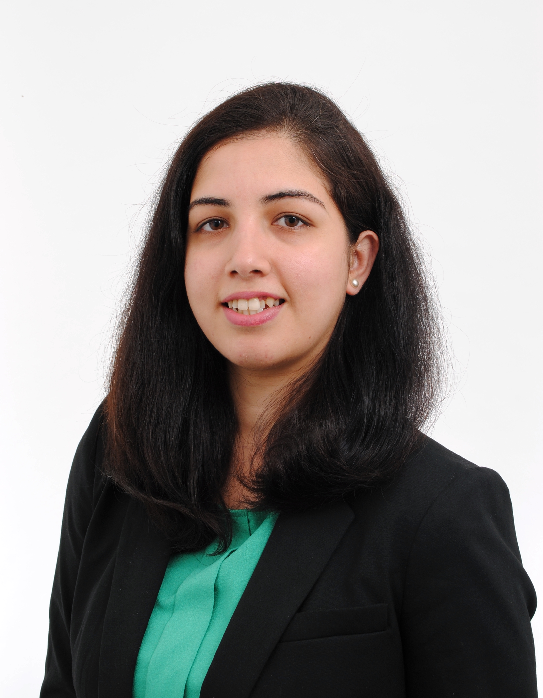

---
---

<link rel="stylesheet" href="styles.css" type="text/css">

# Hello! I am Purva. #

 

I am a computational biologist with a keen interest in developing and applying data analysis approaches in metabolomics, particularly spatial metabolomics. My current research at NIOO-KNAW, Wageningen focuses on developing a computational pipeline for mass spectrometry imaging data acquired to study plant and microbial-interaction samples as well as interpretation of this data. Apart from this, at my current position, I have worked on several collaborative projects for GC-MS and DART data analysis, mass spectrometry-based VOC (volatile organic compound) analysis and statistical analysis of large datasets. My research interests also extend in developing computational approaches for automated image processing and pattern recognition in biological images. 

As a next step, I wish to apply and enhance my expertise to analyze biological data from other -omics modalities to develop integrative computational approaches that can bridge this multi-tiered information, to provide confident over-all biological knowledge for a system under study.

