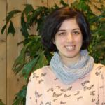

<link rel="stylesheet" href="styles.css" type="text/css">

I am a computational biologist with a keen interest in developing and applying data analysis approaches in metabolomics, particularly spatial metabolomics. My current research at NIOO-KNAW focuses on developing a computational pipeline for mass spectrometry imaging data acquired to study plant and microbial-interaction samples as well as interpretation of this data. My research interests also extend in developing computational approaches for automated image processing and pattern recognition in biological images.